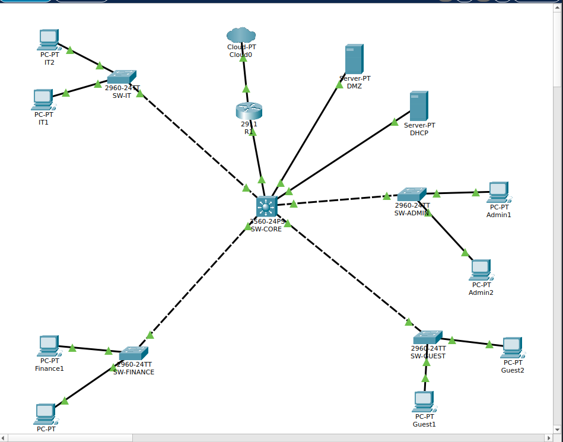
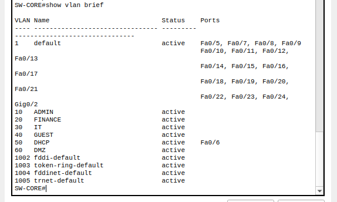
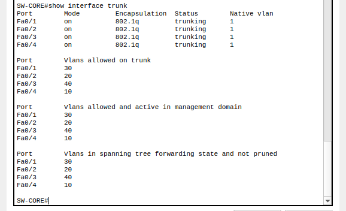
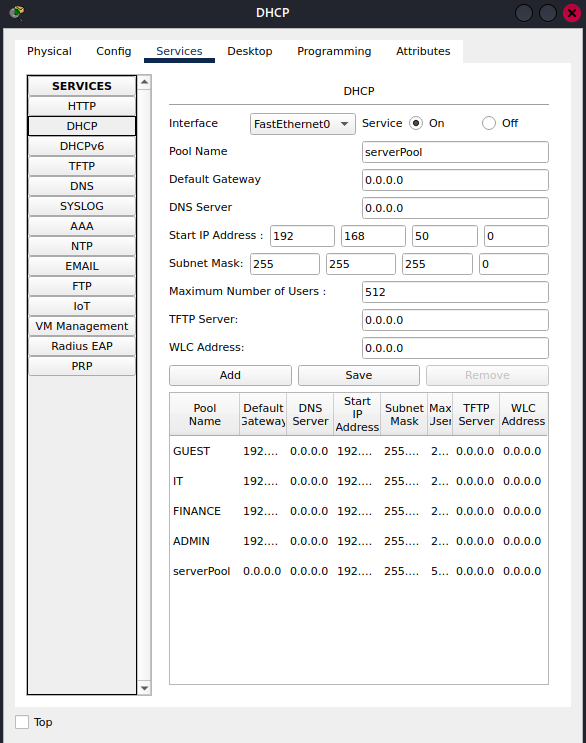
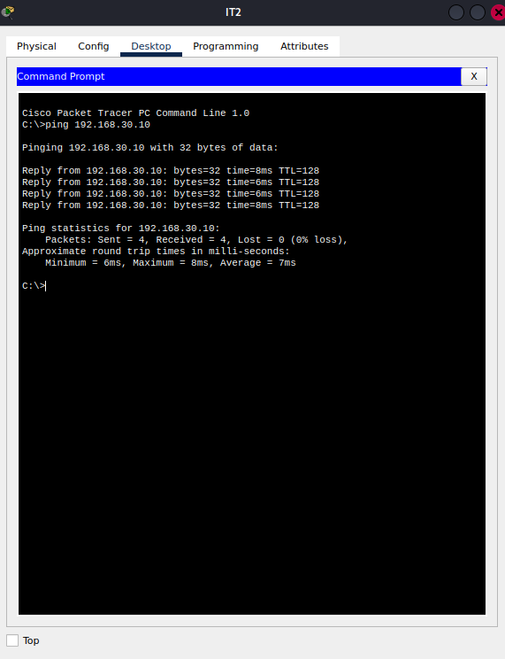
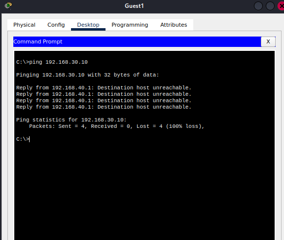

# Network Project – Enterprise Infrastructure (Cisco Packet Tracer)

## Project Overview
This project focuses on the design, configuration, and security of a realistic enterprise network using Cisco Packet Tracer.

The objective is to simulate a professional multi-department network with segmentation, controlled communication, and essential services deployment.

---

## Objectives
- Design and implement a multi-VLAN enterprise network
- Ensure proper network segmentation between departments
- Configure secure inter-VLAN routing using a multilayer switch
- Allow controlled communication between internal networks
- Implement DHCP
- Secure trunk links between switches
- Apply Layer 2 security features (PortFast, BPDU Guard, Port Security)
- Restrict Guest network access using ACLs
- Configure NAT/PAT for Internet access
- Improve overall network stability and security

---

## Network Architecture

The network follows a hierarchical design:

- Access Layer: Department switches
- Core Layer: Multilayer switch (SW-CORE)
- Edge Layer: Router connected to the Internet

### Topology
- 4 Access Switches:
  - Administration
  - Finance
  - IT
  - Guests
- 1 Multilayer Switch (Core)
- 1 Router (Internet Access)
- 1 DHCP Server (VLAN 50)
- 1 DMZ Server (VLAN 60)

---

## IP Addressing Scheme

| VLAN | Department       | Network            |
|------|-----------------|--------------------|
| 10   | Administration  | 192.168.10.0/24    |
| 20   | Finance         | 192.168.20.0/24    |
| 30   | IT              | 192.168.30.0/24    |
| 40   | Guests          | 192.168.40.0/24    |
| 50   | DHCP            | 192.168.50.0/24    |
| 60   | DMZ             | 192.168.60.0/24    |

---

## VLAN and Switching
- VLANs configured on the multilayer switch
- Trunk links between switches
- Access ports assigned per department
- Reduced broadcast domains

---

## Inter-VLAN Routing
- Implemented on the multilayer switch
- SVI (Switched Virtual Interfaces) used as gateways
- IP routing enabled

---

## Network Services

### DHCP Server 
A centralized DHCP server is deployed in VLAN 50.

Server configuration:
- IP Address: 192.168.50.10
- Default Gateway: 192.168.50.1
- DNS: 192.168.50.10

DHCP pools:
- VLAN 10: 192.168.10.0/24
- VLAN 20: 192.168.20.0/24
- VLAN 30: 192.168.30.0/24
- VLAN 40: 192.168.40.0/24

## Security Features

### Access Control Lists (ACL)
- Restrict inter-VLAN traffic
- Block Guests access to Finance
- Allow only necessary traffic

### Port Security
- Limit MAC addresses per port
- Block unauthorized devices

### Disabled Unused Ports
- Reduces attack surface

### DHCP Snooping
- Prevents rogue DHCP servers

## Layer 2 Security 
|Feature | Purpose|
|--------|--------|
|PortFast|Faster end-device connectivity|
|BPDU GUARD|Prevents rogue switches|

---

## Internet Access (NAT/PAT)
- Configured on the edge router
- Enables Internet access for internal users
- Hides private IP addresses

---

## Testing and Validation
- Inter-VLAN communication tested

- ACL filtering validated

- Guest network isolation verified

---

## Results
- Efficient network segmentation
- Strong internal security
- Scalable architecture
- Realistic enterprise simulation

---

## Skills Demonstrated
- VLAN configuration and trunking
- Inter-VLAN routing
- DHCP configuration
- Network security implementation
- NAT/PAT configuration
- Enterprise network design

---

## Conclusion
This project demonstrates the implementation of a secure and scalable enterprise network aligned with CCNA (200-301) objectives.

---

## Author
First-year IT Student at INSI University, Madagascar  
RAKOTONDRAMANANA Nantenaina Mickaël 